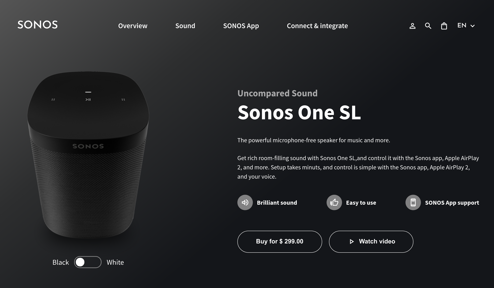
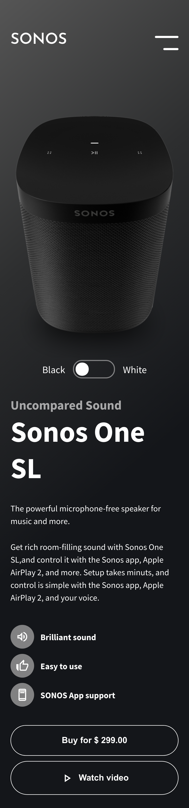

<div align="center" >

<h1 style="font-size: 23px">SONOS Web Page</h1>


</div>

## Table of Contents

- [Overview](#overview)
  - [About](#about)
  - [Technologies](#technologies)
- [How to use](#how-to-use)
- [Contact](#contact)

## Overview

#### Desktop



#

#### Mobile

<div align='center'>

</div>

### About

This project is a UI/UX redesign of the product page **SONOS**.

In the web page you can check the informations of the products, like price and description, you can also check a vídeo (Retired from the official site of SONOS) and change between the colors available.

### Technologies

- [NextJS](https://nextjs.org/) | React framework to create static pages
- [Redux](https://redux.js.org/) | Manage the React states
- [StyledComponents](https://styled-components.com/) | CSS-IN-JS framework to style the page
- [ESLint](https://eslint.org/) | Find problems and force a style of code
- [Prettier](https://prettier.io/) | Code formatting

## How To Use

To clone and run this application, you'll need [Git](https://git-scm.com) and [Node.js](https://nodejs.org/en/download/) (which comes with [npm](http://npmjs.com)) installed on your computer. From your command line:

```bash
# Clone this repository
$ git clone https://github.com/mathmorais/sonos-webpage

# Enter on the root folder
$ cd client

# Install dependencies
$ npm install

# Create a production build from the project
$ npm run build

# Start the production build
$ npm run start
```

## Contact

- GitHub [@mathmorais](https://github.com/mathmorais)

### All the design has been created by [Pascal Looff](https://www.behance.net/pascal-l)
